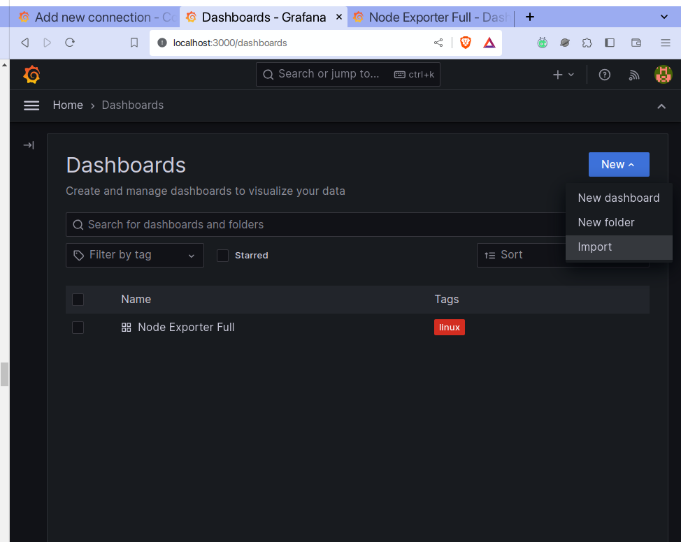
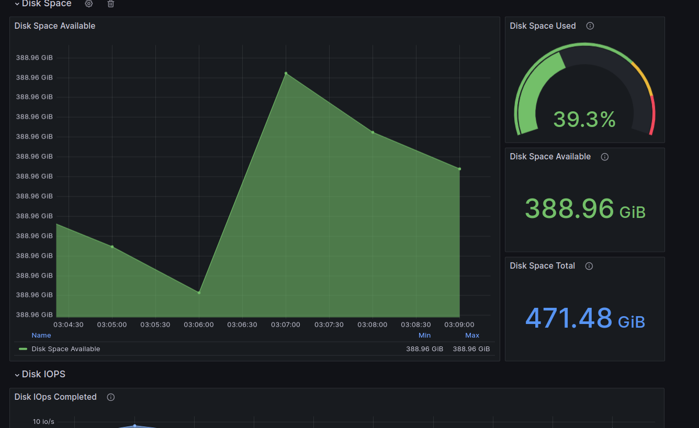
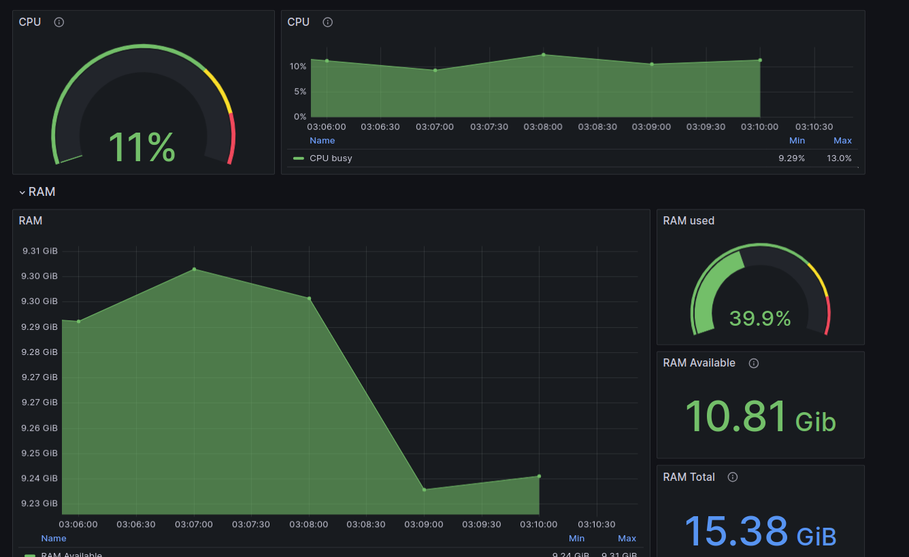
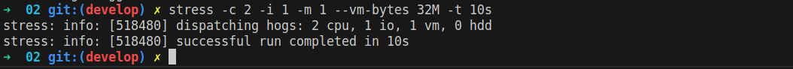

## Part 7. **Prometheus** and **Grafana**

1. Run `./main.sh`

2. Set up Grafana

    2.1 Go to *http://localhost:3000*

    2.2 Log in via username *admin* and password *admin* \
    

    2.3 Add a new connection with data source *Prometheus* \
    

    2.4 In the prometheus server URL field type in ip address written in *prometheus.yml* file on line 11 and port 9090\
    `http://192.168.0.6:9090`

    > Ip address in that line automatically updates when you run main.sh
    >
    > It matches ip address of the network used on the local machine

    

    

    2.5 Click Save&Test button

    2.6 Go to Dashboards and import new dashboard from JSON file \
    

    > Ip address in that file also automatically updates when you run main.sh
    >
    > It matches ip address of the network used on the local machine

    2.7 Configure valid values for the variables in the dashboard \
    

3.  Check CPU, available RAM, free space and the number of I/O operations on the hard disk before and after running the script from part 2

    3.1 Before running the script \
    

    

    

    3.2 After running the script \
    

    

    

4. Check the hard disk, RAM and CPU load with the following command `stress -c 2 -i 1 -m 1 --vm-bytes 32M -t 10s` \
    

    

    

    
